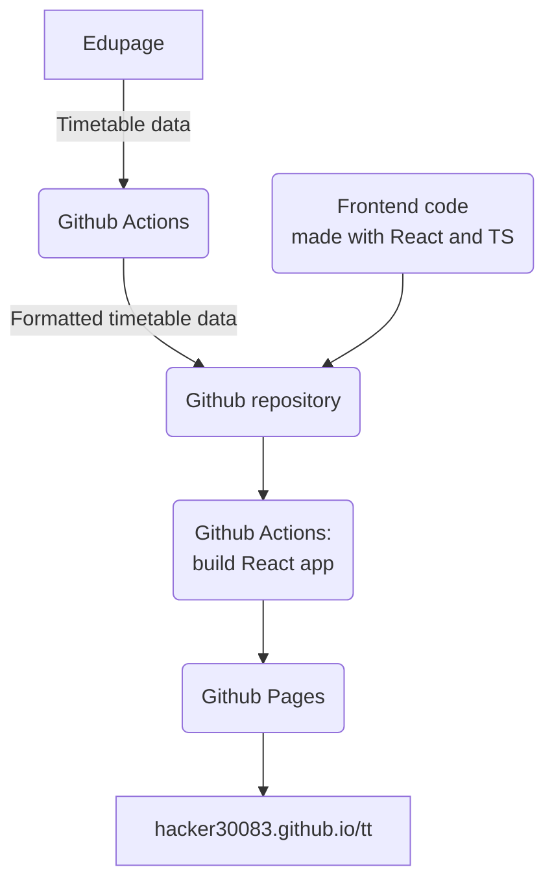

# Automatic Timetable Generator for Tartu Erakool ProTERA and TERA Gymnasium

An automated timetable composition tool for ProTERA and TERA schools. This web application allows students to create personalized timetables by selecting their classes and groups.

## Features

- **Automatic Timetable Generation**: Select your classes and groups to generate a personalized timetable
- **Data Privacy**: Group selections are stored locally in browser cookies
- **Sharing**: Share timetables via encoded links or codes
- **Static Hosting**: Fully static site hosted on GitHub Pages with pre-generated data
- **Real-time Updates**: Data automatically updated via GitHub Actions

## How It Works

The application fetches timetable data from the school's Edupage system, processes it into a structured format, and allows users to filter for their specific classes and groups.

### Architecture



1. **Data Generation**: GitHub Actions runs weekly to fetch latest timetable data from Edupage
2. **Data Storage**: Structured JSON data saved to `data/` directory in the repository
3. **Static Hosting**: GitHub Pages serves the static HTML, CSS, and JS files

## Usage

### Creating a Timetable
1. Visit the application
2. Click "Koosta tunniplaan" (Create Timetable)
3. Select your desired timetable period
4. Choose your class and groups
5. The timetable will be generated and displayed

### Sharing Timetables
- **Via Link**: Click "Jaga" to generate a shareable link containing your selections
- **Via Image**: Click "Laadi alla" to download your timetable

## Data Privacy

- Group selections are stored in browser cookies
- Sharing via link transmits group data to the server (GitHub Pages)

## Development

### Prerequisites
- Node.js 18+
- Git

### Local Development
```bash
git clone https://github.com/mk4i/tt.git
cd tt
npm install
npm run generate  # Generate timetable data
npm run dev
```

### Data Generation
The `generate-data.mjs` script fetches timetable data from TERA school's Edupage system and saves it as JSON files.

### Deployment
- Push to `main` branch to trigger GitHub Actions
- Data is automatically updated daily
- Site is hosted on GitHub Pages

## Documentation

- [Architecture](docs/architecture.md) - System design and components
- [API](docs/api.md) - Edupage API integration details
- [Development](docs/development.md) - Development guide and workflow

## Contributing

1. Fork the repository
2. Create a feature branch
3. Make changes
4. Test locally
5. Submit a pull request

## License

This project is licensed under the MIT License - see the LICENSE file for details.

---

# Automaatne tunniplaani koostaja Tartu Erakool ProTERA 9. klassi jaoks.

## Kuidas see töötab?
Selles programmis on ametlikust tunniplaanist võetud info kirjutatud ümber masinloetavasse formaati. Siis, kui sisestad enda grupid, loeb arvuti kõik läbi ja leiab vastavad tunnid.

## Kes näeb, millistes gruppides ma olen?
Kui sisestad enda grupid, jääb see info Sinu veebilehitseja **küpsistesse**. Tavatingimustes ei lahku see info Sinu seadmest. Jagamisel saavad kõik, kellele lingi saadad, näha, mis grupid sa sisestanud oled.

## Kuidas töötab jagamine?
Kui vajutad *Jaga*, koostab programm lingi ja koodi.

**Kui link avatakse, toimub järgnev:**
1. veebilehitseja esitab päringu serverile
	- Antud juhul esitatakse päring GitHub Pages'ile. Kuna link ise sisaldab gruppide infot, saab GitHub ka selle info teada. Selle vältimiseks saab kasutada koodi ilma lingita.
2. server saadab vastusena programmi
3. programm loeb lingist koodi
4. programm loeb koodist grupid välja
5. programm koostab tunniplaani

**Kui sisestad koodi, toimub järgnev:**
1. programm loeb koodist grupid välja
2. programm koostab tunniplaani

Kui Sa ei soovi, et gruppide koosseisu info kõrvaliste isikute kätte satuks, on targem jagada ainult kood või lihtsalt öelda enda grupid otse teistele.

Kood sisaldab gruppide koosseisu masinloetavas formaadis, kuid võimalik on sellelt grupid välja lugeda ka ilma programmi kasutamata. Lingis on kood parameetrina päringus (st `.../tt/?g=KOOD`).</content>
<parameter name="filePath">/Users/kasparaun/Documents/GitHub/tt/README.md
