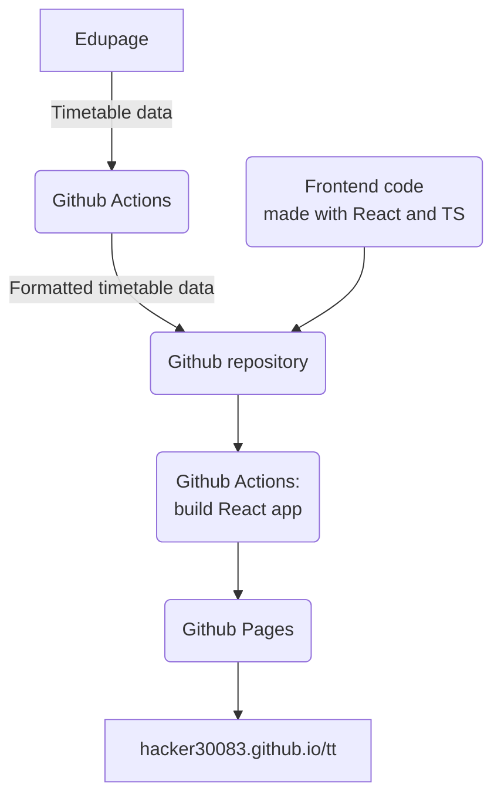

# Architecture Documentation

## Overview

The Timetable Generator is a static web application that provides an interface for students to create personalized timetables from school data. The application has evolved from a server-based architecture to a fully static, GitHub Pages-hosted solution with automated data generation.

## High-Level Architecture


## Components

### 1. Data Generation Pipeline

#### GitHub Actions Workflow (`.github/workflows/generate-data.yml`)
- **Purpose**: Automated data fetching and processing
- **Triggers**:
  - Pushing a commit to `main` branch that affects data generation
  - Weekly schedule (midnight on Saturday UTC)
- **Steps**:
  1. Checkout repository
  2. Setup Node.js environment
  3. Install dependencies
  4. Run data generation script
  5. Commit and push generated data (If changes are present)

#### Data Generation Script (`generate-data.mjs`)
- **Language**: Node.js
- **Dependencies**: axios for HTTP requests
- **Functions**:
  - `fetchTimetables()`: Retrieves list of available timetables
  - `sortTimetables()`: Filters and sorts timetables by date
  - `fetchTimetableByID()`: Fetches detailed timetable data
  - `filterData()`: Processes raw data into structured format
- **Output**: JSON files in `data/` directory

### 2. Static Assets

#### HTML (`index.html`)
- Single-page application entry point
- Mounts the React application root

#### CSS (`src/styles/index.css`, `src/styles/dev.css`)
- Responsive design for timetable display
- Theme variables for colors and fonts
- Mobile-friendly layout

#### React + TypeScript (`src/`)
- **App.tsx**: Main application logic and setup flow
- **components/TimetableGrid.tsx**: Timetable grid rendering
- **lib/**: Data loading, processing, export, and cookie helpers
- **types/**: Shared timetable data contracts

### 3. Data Storage

#### File Structure
```
data/
├── timetables.json    # List of available timetables
├── 68.json           # Structured data for timetable ID 68
├── 96.json           # Structured data for timetable ID 96
└── ...
```

#### Data Formats
- **timetables.json**: Array of timetable metadata
  ```json
  [
    {
      "tt_num": "68",
      "year": 2025,
      "text": "ProTERA ja TERA gümnaasium 2025/2026",
      "datefrom": "2026-01-12",
      "hidden": false
    }
  ]
  ```

- **{id}.json**: Structured timetable data
  ```json
  {
    "teachersMap": { "1": { "id": "1", "name": "Teacher Name" } },
    "classroomsMap": { "1": { "id": "1", "name": "Room 101" } },
    "classesMap": { "1": { "id": "1", "name": "9A" } },
    "groupsMap": { "1": { "id": "1", "name": "Math Group A" } },
    "subjectsMap": { "1": { "id": "1", "name": "Mathematics" } },
    "daysMap": { "1": { "val": "Monday" } },
    "periodsMap": { "1": { "id": "1", "starttime": "08:00" } },
    "lessonsJSON": [ /* lesson data */ ],
    "lessonsCards": [ /* time slot data */ ],
    "lessonsCardsMap": { /* lessonid -> card mapping */ }
  }
  ```

### 4. Client-Side Processing

#### Data Flow
1. User clicks "Koosta tunniplaan"
2. `setup()` function loads timetable list from `data/timetables.json`
3. User selects timetable period
4. Application fetches detailed data from `data/{id}.json`
5. User selects class and groups
6. Timetable is generated and displayed

#### Key Functions
- `load(subDomain)`: Loads and sorts timetables (currently hardcoded to "tera")
- `fetchTimetableByID(id)`: Loads structured data from JSON file
- `filterData()`: Processes raw Edupage data (used in generation, not client)
- `sortTimetables()`: Groups and sorts timetables by date

## Data Sources

### Edupage API
- **Base URL**: `https://{subdomain}.edupage.org`
- **Endpoints**:
  - `/timetable/server/ttviewer.js?__func=getTTViewerData`: List timetables
  - `/timetable/server/regulartt.js?__func=regularttGetData`: Detailed timetable data
- **Authentication**: Uses `__gsh` parameter (appears to be session token)
- **Response Format**: JSON with nested structure

### Current Limitations
- Only supports "tera" subdomain
- API responses may change without notice

## Deployment

### GitHub Pages
- **Source**: `main` branch
- **Build**: `npm run build` (static hosting of the resulting files)
- **URL**: `https://hacker30083.github.io/tt/`

### Build Process
- Build with `npm run build`
- All assets served statically
- Data updated via GitHub Actions

## Security Considerations

### Data Privacy
- User selections stored in browser cookies
- Sharing via links exposes data in URL parameters
- No server-side user data storage

### API Security
- No authentication required for data fetching
- Data is publicly available from Edupage

## Performance

### Client-Side
- Initial load: ~50KB (HTML/CSS/JS)
- Data loading: ~100-500KB per timetable (cached)
- Processing: Fast (client-side JavaScript)

### Data Generation
- Runs in GitHub Actions (Ubuntu)
- Network requests to Edupage API
- Processing time: ~1-2 minutes
- Storage: ~1-5MB JSON files

## Future Improvements

### Scalability
- Support multiple school subdomains
- Incremental data updates
- CDN for static assets

### Reliability
- API monitoring and error handling
- Fallback data sources
- Data validation

### Features
- Offline support (Service Worker)
- Calendar export

## Development Workflow

1. **Local Development**
   - Clone repository
   - Run `npm install`
   - Execute `npm run generate` for data
   - Run `npm run dev`

2. **Testing**
   - Manual testing in browser
   - Validate data generation
   - Check GitHub Actions logs
   - Validate that `npm run build` also succeeds
   - Run `npm run test` and verify everything succeeds

3. **Deployment**
   - Push to `main` branch
   - GitHub Actions generates data
   - Site updates automatically

## Dependencies

### Runtime
- **React 19**: UI rendering and state management
- **Browser APIs**: fetch, cookies, clipboard, fonts

### Development
- **Node.js 18+**: Data generation
- **axios**: HTTP client for data fetching
- **GitHub Actions**: CI/CD pipeline</content>
<parameter name="filePath">/Users/kasparaun/Documents/GitHub/tt/docs/architecture.md
