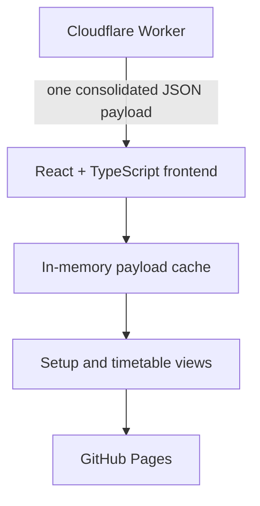

# Architecture overview

The timetable generator is a static React application deployed to GitHub Pages. Its runtime data source is a Cloudflare Worker, not the JSON files committed to this repository and not Edupage directly.

## High-level flow


```mermaid
flowchart TD
    A[Cloudflare Worker] -->|one consolidated JSON payload| B[React + TypeScript frontend]
    B --> C[In-memory payload cache]
    C --> D[Setup and timetable views]
    D --> E[GitHub Pages]
```

The worker endpoint is defined in [src/lib/timetableHelper.ts](../src/lib/timetableHelper.ts):

```text
https://tera-edupage-data-store.hacker30083.workers.dev/
```

## Main building blocks

### 1. Runtime data loading

[src/lib/timetableHelper.ts](../src/lib/timetableHelper.ts) requests the worker with `fetch(..., { cache: "no-store" })`. It validates that the returned payload has a `timetables` array and a `details` object.

The first request is retained in a module-level promise. Consequently, metadata and timetable-detail lookups share one network request during a page lifetime. The app uses the selected timetable ID to retrieve its structured detail from `details`.

The frontend does not call Edupage and does not read [data](../data) at runtime.

### 2. Frontend application

The frontend lives in [src](../src) and is built with Vite. Its main pieces are:

- [src/App.tsx](../src/App.tsx) – page state, selection restoration, and setup flow
- [src/pages](../src/pages) – home, setup, confirmation, and timetable views
- [src/components](../src/components) – reusable UI such as the timetable grid and banner
- [src/hooks](../src/hooks) – navigation, preferences, selection, and setup-flow state
- [src/lib](../src/lib) – remote data loading, timetable construction, exporting, and banner logic
- [src/utils](../src/utils) – selection-payload encoding and setup helpers

### 3. Legacy generated data

[generate-data.mjs](../generate-data.mjs) can still obtain timetable data from Edupage and write JSON files to [data](../data). The scheduled [generate-data workflow](../.github/workflows/generate-data.yml) continues to run that script and open a pull request for changes.

This is a separate, legacy repository workflow. The static frontend does not consume these files; updating them does not update the data returned by the Cloudflare Worker.

### 4. Deployment pipeline

The [Pages workflow](../.github/workflows/deploy-pages.yml) runs tests, builds the Vite bundle, and publishes [dist](../dist) to GitHub Pages. The worker is a separate service and is not deployed by this repository's Pages workflow.

## Runtime behaviour

1. When setup begins (or a saved selection is restored), the app loads the worker payload if it has not already been loaded.
2. The setup flow reads the timetable list from that payload.
3. After a timetable is selected, the app looks up its structured data in the already-loaded payload.
4. The app builds the visible timetable client-side from the selected class and groups.
5. The selection is stored in cookies and may be shared through an encoded URL.

## Data and privacy

- The app does not send a user's selected groups to the timetable-data worker.
- Selection state is stored in browser cookies and is included in a share URL only when the user chooses to share it.
- The timetable worker receives the normal request metadata a browser sends when retrieving public data.
- Firebase is optional and only controls the visible site banner.

## Dependencies

### Runtime

- React 19 – UI rendering and state management
- Browser APIs – `fetch`, cookies, clipboard, and fonts

### Development

- Node.js 20+ – development, testing, and the legacy generator
- Vitest – tests
- GitHub Actions – CI and Pages deployment
