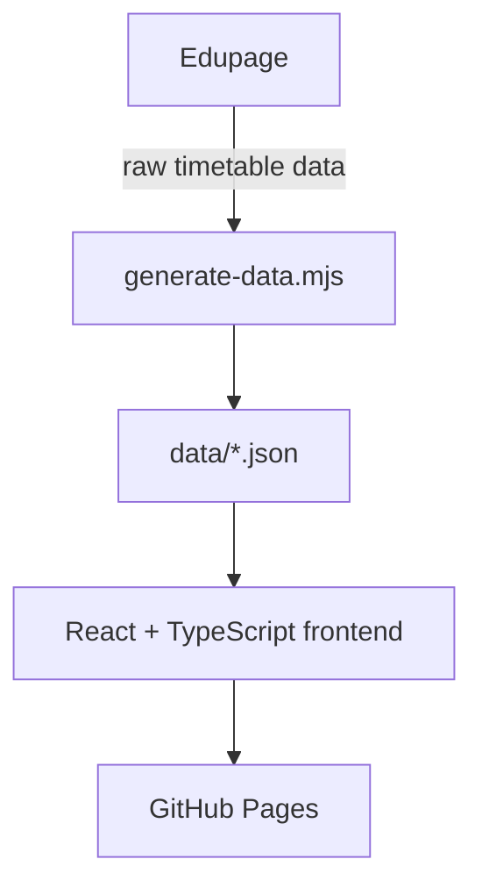

# Architecture Overview

The timetable generator is a static React application. It does not rely on a server-side runtime; instead, it ships a frontend bundle to GitHub Pages and loads pre-generated timetable data from the repository.

## High-level flow

```mermaid
flowchart TD
    A[Edupage] -->|raw timetable data| B[generate-data.mjs]
    B --> C[data/*.json]
    C --> D[React + TypeScript frontend]
    D --> E[GitHub Pages]
```

## Main building blocks

### 1. Data generation pipeline

The script in [generate-data.mjs](../generate-data.mjs) performs three main steps:

1. Fetch a list of timetables from the Edupage timetable viewer endpoint.
2. Fetch the detailed timetable data for the relevant ProTERA entries.
3. Transform the response into structured JSON files and write them to [data](../data).

The workflow in [.github/workflows/generate-data.yml](../.github/workflows/generate-data.yml) runs this script automatically on pushes to main, on a weekly schedule, and manually.

### 2. Frontend application

The frontend lives in [src](../src) and is built with Vite. The main pieces are:

- [src/App.tsx](../src/App.tsx) – orchestrates page state, selection restoration, and the setup flow
- [src/pages](../src/pages) – home, setup, and timetable display pages
- [src/components](../src/components) – reusable UI pieces such as the timetable grid and banner
- [src/hooks](../src/hooks) – state hooks for navigation, preferences, selection, and setup flow
- [src/lib](../src/lib) – timetable construction, data loading, export, and banner logic
- [src/utils](../src/utils) – selection payload encoding and other helpers

### 3. Generated data files

The generated data is stored in [data](../data) and is the source of truth for the app at runtime.

- [data/timetables.json](../data/timetables.json) contains the available timetable metadata.
- Each timetable ID has a corresponding JSON file (for example, [data/68.json](../data/68.json)) with the structured lesson and class/group definitions.

### 4. Deployment pipeline

The workflow in [.github/workflows/deploy-pages.yml](../.github/workflows/deploy-pages.yml) builds the Vite bundle, runs the test suite, and publishes the contents of [dist](../dist) to GitHub Pages.

## Runtime behaviour

When a user opens the app:

1. The app loads the available timetables and presents the setup flow.
2. The user selects a timetable, class, and one or more groups.
3. The app loads the corresponding generated JSON file and builds the timetable client-side.
4. The selection is stored in cookies and can be shared through an encoded URL.

## Notes on data and privacy

- The app does not keep user data on a server.
- Selection state is stored in the browser and can be shared through the URL when the user chooses to share it.
- The Firebase banner is optional and only affects the visible banner state.

   - GitHub Actions generates data
   - Site updates automatically

## Dependencies

### Runtime
- **React 19**: UI rendering and state management
- **Browser APIs**: fetch, cookies, clipboard, fonts

### Development
- **Node.js 18+**: Data generation
- **axios**: HTTP client for data fetching
- **GitHub Actions**: CI/CD pipeline</content>
<parameter name="filePath">/Users/kasparaun/Documents/GitHub/tt/docs/architecture.md
